# 🤖 Multimodal Fashion Assistant

An AI-powered fashion assistant that retrieves and reasons over images and text to deliver precise and relevant fashion recommendations using VLM models.

##


## 📋 Table of Contents

- [About](#about)
- [Features](#features)
- [Data](#data)
- [Method](#method)
- [Quick Start](#quick-start)
- [Installation](#installation)
- [Usage](#usage)
- [Example: Image Similarity Search](#example-image-similarity-search)
- [Example: Retrieve Products from Handwritten List](#example-retrieve-products-from-handwritten-list)
- [Project Structure](#project-structure)
- [Contributing](#contributing)
- [Support](#support)
- [Acknowledgments](#acknowledgments)

## About

The Multimodal Fashion Assistant is a retrieval and reasoning system built on two models: SigLIP2-base for embeddings and Qwen-VL (2B) for multimodal understanding. SigLIP2 generates image and text embeddings for similarity search, and Qwen-VL interprets the user query, extracts product attributes, and handles reasoning tasks.

The system supports image search, text search, and combined multimodal search. Users can upload a product photo, describe an item, or refine the request through follow-up prompts. The backend then returns the closest matching products based on visual and semantic similarity.

In addition to fashion retrieval, the system can read text from images. It can extract items from a photographed shopping list by interpreting the text directly from the image, which allows it to act like an OCR-style component without using a separate OCR engine.

This project is built as a practical and fast backend module. It requires no dedicated front end and focuses on accurate search, flexible input handling, and efficient reasoning over fashion data.

##  Features

- 🎯 **Similarity Search**: Find visually similar clothing items using text and/or image embeddings.
- ⚡ **Attribute Filtering**: Filter fashion items based on specific attributes like color, style, material and more.
- 📝 **OCR Item Extractor**: Extracts item names from a photographed shopping list (performs OCR-like text reading). 
- 🤖 **Interactive Conversations**: Engage in multi-turn conversations to refine your fashion search.
- 🛠️ **Extensible Architecture**: Easily integrate new models and features.

##  Data

Utilized [DeepFashion2 Dataset](https://github.com/switchablenorms/DeepFashion2?tab=readme-ov-file)

##  Method

-  **Image Filtering**: Filtered unique dress image that has "shop" category.
-  **Image Cropping**: Cropped image according to the bounding box annotations.
-  **Text Description**: Used QwenVL (2B) to generate descriptions of clothing items.
- **Embeddings**: Used SigLip2 (base) to generate text and image embeddings and saved them in FAISS index.
- **Meta Data**: Stored all the metadata information of the images along with the embeddings.
-  **Reasoning**: Used QwenVL (2B) for multimodal reasoning in chatbot.
-  **Retreival**: Used SigLip2 (base) for retreival.

##  Quick Start

Clone and run the Jupyter Notebook:

```bash
git clone https://github.com/Abrar-Islam-Oitijjho/Multimodal-Fashion-Assistant.git
cd Multimodal-Fashion-Assistant
jupyter notebook Multimodal_Fashion_Assistant.ipynb
```

Open the notebook in your browser and follow the instructions.

##  Installation

### Prerequisites

- Python 3.11+
- Jupyter Notebook 7.4.5
- PyTorch 2.9.1+cu126
- Transformers 5.0.0.dev0
- Other dependencies listed in `requirements.txt`

### Steps

1.  Clone the repository:

```bash
git clone https://github.com/Abrar-Islam-Oitijjho/Multimodal-Fashion-Assistant.git
cd Multimodal-Fashion-Assistant
```

2.  Create a virtual environment using Anaconda Prompt (recommended):

```bash
conda create -n venv python=3.11 anaconda
conda activate venv
conda install ipykernel
ipython kernel install --user --name=kernelname
```

3.  Install dependencies:

```bash
pip install -r requirements.txt
```

##  Usage

1.  Open the Jupyter Notebook:

```bash
conda activate venv
jupyter notebook
```

2. Then find the notebook "multimodal_reasoning.ipynb" and open it.

3.  Follow the instructions within the notebook to load models, process data, and interact with the fashion assistant.

## Example: Image Similarity Search

```python
# Example code
user_query = "Do you have any dress like this?"

image_directory = r"../Data/Example"
image_path = os.path.join(image_directory, "internet_example13.jpg")
image = Image.open(image_path).convert("RGB")
```
### Example Input


### Example Output

```
The user wants a red and black plaid dress with a Peter Pan collar. The dress has a fit-and-flare silhouette and long sleeves.
It is made of a material that appears to be a blend of cotton and polyester. The dress features a button-down front and a waistband with a belt.
The notable features of the dress include the Peter Pan collar, the fit-and-flare silhouette.
```

### Retrieved Images (Top 2)
<p>
  
  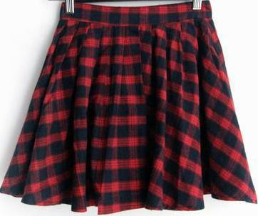
</p>


### Example: Follow-up Conversation

```python
user_query = "Do you have the dress in blue color?"
```

### Example Output

```
The user wants a blue dress with a Peter Pan collar, a fit-and-flare silhouette, long sleeves, and a waistband with a belt.
The dress is made of a material that appears to be a blend of cotton and polyester.
The notable features of the dress include the Peter Pan collar, the fit-and-flare silhouette, and the waistband with a belt.
```

### Retrieved Images (Top 2)
<p>
  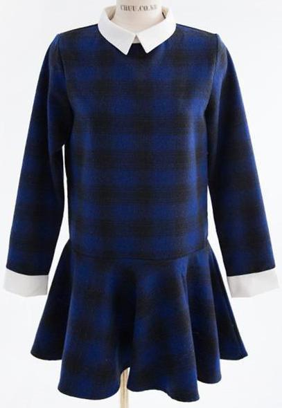
  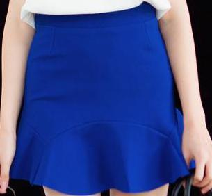
</p>

### Example: Second Follow-up Conversation

```python
user_query = "Do you have any t-shirt that matches with this blue dress?"
```

### Example Output

```
The user wants a blue t-shirt that matches the blue dress they mentioned earlier.
The t-shirt should have a Peter Pan collar, a fit-and-flare silhouette, long sleeves, and a waistband with a belt.
The material should be a blend of cotton and polyester. The notable features of the t-shirt include the Peter Pan collar, the fit-and-flare silhouette, and the waistband with
```

### Retrieved Images (Top 2)
<p>
  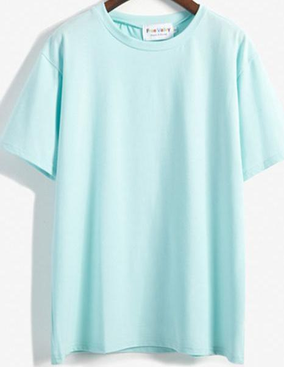
  
</p>

## Example: Retrieve Products from Handwritten List

### Example Input


### Example Output

```
The items in the list: ['Full length skirt', 'White formal shirt', 'Black formal pants', 'Comfy trousers']
```

### Retrieved Images: Full length skirt (Top 2)
<p>
  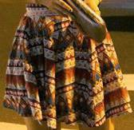
  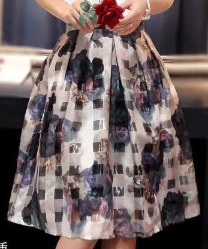
</p>

### Retrieved Images: White formal shirt (Top 2)
<p>
  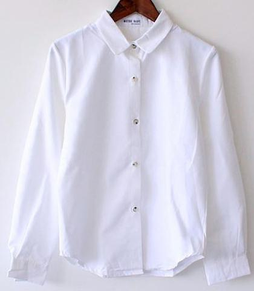
  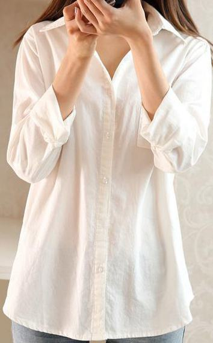
</p>

### Retrieved Images: Black formal pants (Top 2)
<p>
  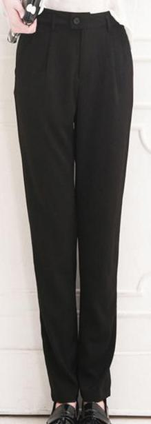
  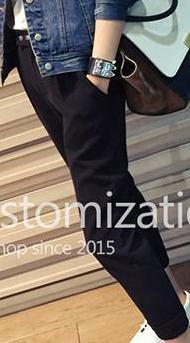
</p>

### Retrieved Images: Comfy trousers (Top 2)
<p>
  
  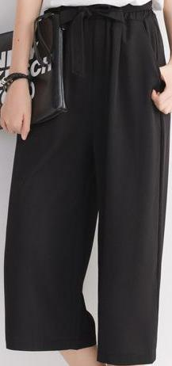
</p>

##  Project Structure

```
Multimodal-Fashion-Assistant/
├── 📁 Data/                                 # Fashion dataset and image files
├── 📁 CSVs/                                 # Generated metadata saved in csv format
├── 📁 assets/                               # assets to the project
├── 📁 Code/                                 # Source code for the fashion assistant
│   ├── 📄 data_preprocessing.ipynb          # For preprocessing the data
│   ├── 📄 data_preprocessing_helper.py      # Utility functions for data-preprocessing
│   └── 📄 description_generator.ipynb       # Generate descriptions for each image
    └── 📄 description_generator.ipynb       # Generate descriptions for each image
    └── 📄 description_generator_helper.py   # Utility functions for descriptions generator
    └── 📄 embedding_generator.ipynb         # Generates text and image embedding for each image
    └── 📄 embeddings_generator_helper.py    # Utility functions for embedding generator
    └── 📄 multimodal_reasoning.ipynb        # Multimodal chatbot
    └── 📄 multimodal_reasoning_helper.py    # Utility functions for multimodal chatbot

├── 📄 requirements.txt        # Project dependencies
├── 📄 README.md               # Project documentation
```

##  Contributing

Contributions are welcomed!

### Quick Contribution Steps

1.  🍴 Fork the repository
2.  🌟 Create your feature branch (`git checkout -b feature/AmazingFeature`)
3.  ✅ Commit your changes (`git commit -m 'Add some AmazingFeature'`)
4.  📤 Push to the branch (`git push origin feature/AmazingFeature`)
5.  🔃 Open a Pull Request

##  Support

-   📧 **Email**: abraroitijjho35@gmail.com
-   🐛 **Issues**: [GitHub Issues](https://github.com/Abrar-Islam-Oitijjho/Multimodal-Fashion-Assistant/issues)

##  Acknowledgments

-   📚 **Libraries/Tools used**:
    -   [PyTorch](https://pytorch.org/) - Deep learning framework
    -   [Transformers](https://huggingface.co/transformers/) - NLP library
    -   [Anaconda](https://anaconda.org/) – Python distribution with environment and package management
-   🌟 **Special thanks**: To the open-source community for their invaluable contributions.
