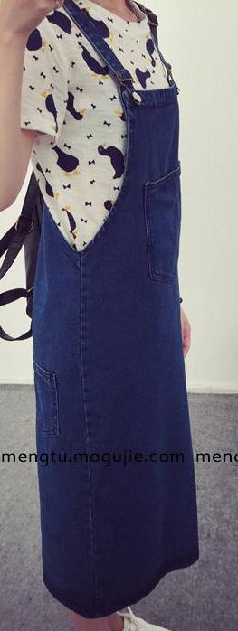

# 🚀 Multimodal Fashion Assistant

A cutting-edge fashion assistant leveraging multimodal AI for personalized style recommendations and interactive fashion experiences.

Your personal AI stylist, combining visual search, attribute filtering, and conversational AI to revolutionize your wardrobe.

##


## 📋 Table of Contents

- [About](#about)
- [Features](#features)
- [Quick Start](#quick-start)
- [Installation](#installation)
- [Usage](#usage)
- [Project Structure](#project-structure)
- [Contributing](#contributing)
- [Support](#support)
- [Acknowledgments](#acknowledgments)

## About

The Multimodal Fashion Assistant is a retrieval and reasoning system built on two models: SigLIP2-base for image and text embeddings, and Qwen-VL (2B) for multimodal reasoning. The system processes images and text to generate meaningful representations, runs similarity search, and handles attribute-based queries. It can operate in multimodal mode or as a single-mode (image-only or text-only) retrieval tool.

The pipeline uses SigLIP2 to extract high-quality embeddings from user input, while Qwen-VL interprets queries, extracts product attributes, and resolves complex fashion-related questions. Users can upload an image, describe a product, or refine their request through follow-up prompts. The system then returns the closest matching items based on visual and semantic similarity.

This project focuses on practical, fast, and accurate fashion retrieval without requiring a dedicated front end. It acts as a flexible backend module that supports image search, text search, and multimodal reasoning for fashion data.

##  Features

- 🎯 **Similarity Search**: Find visually similar clothing items using image embeddings.
- ⚡ **Attribute Filtering**: Filter fashion items based on specific attributes like color, style, material and more.
- 🤖 **Interactive Conversations**: Engage in multi-turn conversations to refine your fashion search.
- 🛠️ **Extensible Architecture**: Easily integrate new models and features.

##  Quick Start

Clone and run the Jupyter Notebook:

```bash
git clone https://github.com/Abrar-Islam-Oitijjho/Multimodal-Fashion-Assistant.git
cd Multimodal-Fashion-Assistant
jupyter notebook Multimodal_Fashion_Assistant.ipynb
```

Open the notebook in your browser and follow the instructions.

##  Installation

### Prerequisites

- Python 3.11+
- Jupyter Notebook 7.4.5
- PyTorch 2.9.1+cu126
- Transformers 5.0.0.dev0
- Other dependencies listed in `requirements.txt`

### Steps

1.  Clone the repository:

```bash
git clone https://github.com/Abrar-Islam-Oitijjho/Multimodal-Fashion-Assistant.git
cd Multimodal-Fashion-Assistant
```

2.  Create a virtual environment using Anaconda Prompt (recommended):

```bash
conda create -n venv python=3.11 anaconda
conda activate venv
conda install ipykernel
ipython kernel install --user --name=kernelname
```

3.  Install dependencies:

```bash
pip install -r requirements.txt
```

##  Usage

1.  Open the Jupyter Notebook:

```bash
conda activate venv
jupyter notebook
```

2. Then find the notebook "multimodal_reasoning.ipynb" and open it.

3.  Follow the instructions within the notebook to load models, process data, and interact with the fashion assistant.

### Example: Image Similarity Search

```python
# Example code (Illustrative - refer to notebook for actual implementation)
user_query = "Do you have any dress like this?"

image_directory = r"../Data/Example"
image_path = os.path.join(image_directory, "internet_example13.jpg")
image = Image.open(image_path).convert("RGB")
```

### Example Output

```
The user wants a red and black plaid dress with a Peter Pan collar. The dress has a fit-and-flare silhouette and long sleeves.
It is made of a material that appears to be a blend of cotton and polyester. The dress features a button-down front and a waistband with a belt.
The notable features of the dress include the Peter Pan collar, the fit-and-flare silhouette.
```

### Retrieved Images (Top 2)
<p>
  
  
</p>


### Example: Follow-up Conversation

```python
user_query = "Do you have the dress in blue color?"
```

### Example Output

```
The user wants a blue dress with a Peter Pan collar, a fit-and-flare silhouette, long sleeves, and a waistband with a belt.
The dress is made of a material that appears to be a blend of cotton and polyester.
The notable features of the dress include the Peter Pan collar, the fit-and-flare silhouette, and the waistband with a belt.
```

### Retrieved Images (Top 2)
<p>
  
  
</p>

### Example: Second Follow-up Conversation

```python
user_query = "Do you have any t-shirt that matches with this blue dress?"
```

### Example Output

```
The user wants a blue t-shirt that matches the blue dress they mentioned earlier.
The t-shirt should have a Peter Pan collar, a fit-and-flare silhouette, long sleeves, and a waistband with a belt.
The material should be a blend of cotton and polyester. The notable features of the t-shirt include the Peter Pan collar, the fit-and-flare silhouette, and the waistband with
```

### Retrieved Images (Top 2)
<p>
  
  
</p>

##  Project Structure

```
Multimodal-Fashion-Assistant/
├── 📁 Data/                                 # Fashion dataset and image files
├── 📁 CSVs/                                 # Generated metadata saved in csv format
├── 📁 assets/                               # assets to the project
├── 📁 Code/                                 # Source code for the fashion assistant
│   ├── 📄 data_preprocessing.ipynb          # For preprocessing the data
│   ├── 📄 data_preprocessing_helper.py      # Utility functions for data-preprocessing
│   └── 📄 description_generator.ipynb       # Generate descriptions for each image
    └── 📄 description_generator.ipynb       # Generate descriptions for each image
    └── 📄 description_generator_helper.py   # Utility functions for descriptions generator
    └── 📄 embedding_generator.ipynb         # Generates text and image embedding for each image
    └── 📄 embeddings_generator_helper.py    # Utility functions for embedding generator
    └── 📄 multimodal_reasoning.ipynb        # Multimodal chatbot
    └── 📄 multimodal_reasoning_helper.py    # Utility functions for multimodal chatbot

├── 📄 requirements.txt        # Project dependencies
├── 📄 README.md               # Project documentation
└── 📄 LICENSE                 # License file
```

##  Contributing

We welcome contributions!

### Quick Contribution Steps

1.  🍴 Fork the repository
2.  🌟 Create your feature branch (`git checkout -b feature/AmazingFeature`)
3.  ✅ Commit your changes (`git commit -m 'Add some AmazingFeature'`)
4.  📤 Push to the branch (`git push origin feature/AmazingFeature`)
5.  🔃 Open a Pull Request

##  Support

-   📧 **Email**: abraroitijjho35@gmail.com
-   🐛 **Issues**: [GitHub Issues](https://github.com/Abrar-Islam-Oitijjho/Multimodal-Fashion-Assistant/issues)

##  Acknowledgments

-   🎨 **Design inspiration**: [Dribbble](https://dribbble.com/)
-   📚 **Libraries used**:
    -   [PyTorch](https://pytorch.org/) - Deep learning framework
    -   [Transformers](https://huggingface.co/transformers/) - NLP library
    -   [Anaconda](https://anaconda.org/) – Python distribution with environment and package management
-   🌟 **Special thanks**: To the open-source community for their invaluable contributions.
