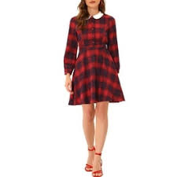
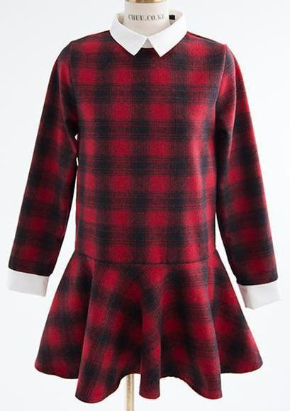
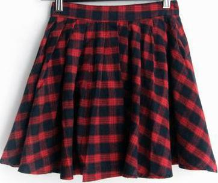

# Multimodal Fashion Assistant

An agentic multimodal fashion retrieval and reasoning system that searches fashion products using text, image, or combined image-text input. The updated version converts the earlier notebook-based project into a modular Python codebase with LangGraph workflow orchestration and FastAPI REST endpoints.

##


## 📋 Table of Contents

- [About](#about)
- [What Changed in the Updated Version](#what-changed-in-the-updated-version)
- [Features](#features)
- [Data](#data)
- [Method](#method)
- [Agent Workflow](#agent-workflow)
- [FastAPI Endpoints](#fastapi-endpoints)
- [Quick Start](#quick-start)
- [Installation](#installation)
- [Usage](#usage)
- [Example: Image Similarity Search](#example-image-similarity-search)
- [Example: FastAPI Image Search](#example-fastapi-image-search)
- [Project Structure](#project-structure)
- [Roadmap](#roadmap)
- [Contributing](#contributing)
- [Support](#support)
- [Acknowledgments](#acknowledgments)

## About

The Multimodal Fashion Assistant is a retrieval and reasoning system for fashion product search. It uses SigLIP2-base embeddings for image and text similarity search, FAISS for fast nearest-neighbor retrieval, and a reasoning layer to interpret user intent and generate a better search description.

The first version of this project was notebook-heavy. The updated version moves the main logic into reusable Python modules, adds a configuration layer, loads models and indexes through services, and runs the retrieval pipeline through a LangGraph workflow. The system can now also be served through FastAPI REST endpoints for online application deployment.

The current stable implementation is frozen at **Step 7**. Step 8 is intentionally not included in this version.

## What Changed in the Updated Version

The updated repo focuses on turning the original fashion retrieval notebook into a cleaner agentic backend.

### Main improvements

- Cleaned and modularized notebook logic into Python files under `app/`.
- Added centralized path and model settings in `app/config.py`.
- Added reusable loading services for metadata, FAISS indexes, embeddings, and reasoning components.
- Added LangGraph workflow orchestration instead of running every step manually in a notebook.
- Added intent detection to identify text-only, image-only, and image-text searches.
- Added dynamic retrieval strategy selection for text-only, image-only, image-priority multimodal, and balanced multimodal search.
- Added structured product query extraction for category, color, pattern, collar, sleeve, material, fit, style, and constraints.
- Added separate image and text retrieval paths, then merged candidates by product identity.
- Added category and attribute-aware soft filtering.
- Added reranking over a larger candidate pool before selecting final results.
- Added a quality self-check node with one retry path when the first retrieval result is weak.
- Added FastAPI endpoints for text search and image/image-text search.
- Added image URL support in API responses so retrieved product images can be viewed directly in the browser.

## Features

- 🎯 **Text Search**: Retrieve fashion products from natural language queries.
- 🖼️ **Image Search**: Retrieve visually similar clothing items from an uploaded image.
- 🔀 **Multimodal Search**: Combine image and text input for better matching.
- 🧠 **Intent-Aware Routing**: Decide whether the user is doing text-only, image-only, image-priority, or full multimodal search.
- 🧾 **Structured Query Extraction**: Extract product type, colors, pattern, collar, sleeve, material, fit, style, and constraints.
- ⚖️ **Dynamic Alpha Selection**: Control the balance between image and text retrieval scores.
- 🔍 **Separate Retrieval Paths**: Run image retrieval and text retrieval independently before merging results.
- 🧹 **Soft Attribute Filtering**: Down-rank weak matches without removing all candidates too aggressively.
- 📊 **Reranking**: Reorder the top candidate pool using product metadata and match quality.
- ✅ **Self-Check and Retry**: Evaluate result quality and retry once with a broader query when needed.
- 🚀 **FastAPI Deployment Layer**: Serve the Step 7 workflow through REST endpoints.

## Data

This project uses a processed subset of the [DeepFashion2 Dataset](https://github.com/switchablenorms/DeepFashion2?tab=readme-ov-file).

The expected data layout is:

```text
Data/
├── annos/                         # Annotation JSON files
├── train/
│   └── image/                     # Product images used by FastAPI static image serving
├── cropped_image_unique/          # Cropped unique product images
├── master_csv.csv                 # Product metadata
├── new_master_csv.csv             # Processed metadata with descriptions
├── faiss_image_siglip2_base.index # FAISS image index
└── faiss_text_siglip2_base.index  # FAISS text index
```

Product image names can follow the format used in the dataset, such as:

```text
000002_item1.jpg
000002_item2.jpg
000123_item1.jpg
```

The FastAPI image URL is created from the image filename. For example:

```text
http://127.0.0.1:8000/images/000002_item2.jpg
```

## Method

The updated pipeline follows these main steps:

1. **Preprocessing**: Read DeepFashion2 annotations and prepare product metadata.
2. **Image Cropping**: Crop clothing items using annotation bounding boxes.
3. **Description Generation**: Generate or store product-level fashion descriptions.
4. **Embedding Generation**: Use SigLIP2-base to generate image and text embeddings.
5. **FAISS Indexing**: Store image and text embeddings in separate FAISS indexes.
6. **Intent Analysis**: Detect whether the input is text-only, image-only, or image-text.
7. **Structured Query Extraction**: Extract fashion attributes from the query or generated search description.
8. **Dynamic Retrieval**: Choose image, text, image-priority, or multimodal retrieval.
9. **Candidate Merge**: Merge image and text candidates by `image_id + item_id`, not raw FAISS index alone.
10. **Soft Filtering**: Reward matching category and attributes while penalizing clear mismatches.
11. **Reranking**: Rerank the top 20 to 50 candidates before returning the final products.
12. **Quality Check and Retry**: Check match quality and retry once if results are poor.
13. **API Response**: Return products, scores, metadata, image paths, and image URLs through FastAPI.

## Agent Workflow

The current stable LangGraph file is:

```text
app/graph_workflow_step7.py
```

The workflow is:

```text
START
  ↓
analyze_user_intent
  ↓
decide_retrieval_strategy
  ↓
generate_search_description
  ↓
extract_structured_query
  ↓
retrieve_image_candidates
  ↓
retrieve_text_candidates
  ↓
merge_candidates
  ↓
filter_candidates
  ↓
rerank_candidates
  ↓
evaluate_result_quality
  ├── poor result: rewrite_query_and_retry → retrieve again once
  └── good result: update_conversation
  ↓
END
```

### Step 1: Intent detection and strategy routing

The graph first checks whether the user provided text, an image, or both. It then classifies the request as a normal product search, a similar-product search, a refinement request, or missing input.

### Step 2: Dynamic retrieval strategy

The graph chooses one of these retrieval modes:

```text
text_only
image_only
image_priority_multimodal
multimodal
none
```

The selected mode controls the `alpha` value used during score merging:

```text
alpha near 1.0 = stronger image retrieval weight
alpha near 0.0 = stronger text retrieval weight
```

### Step 3: Structured query extraction

The workflow extracts a structured query like:

```json
{
  "product_type": "dress",
  "colors": ["black", "red"],
  "pattern": "plaid",
  "collar": "peter pan collar",
  "sleeve": "long sleeve",
  "material": null,
  "fit": null,
  "style": null,
  "constraints": []
}
```

This makes filtering, reranking, debugging, and API output easier.

### Step 4: Separate image and text retrieval

Image and text retrieval run as separate paths. The results are merged using product identity:

```text
product_key = image_id + item_id
```

This is safer than relying only on raw FAISS row indices.

### Step 5: Category and attribute filtering

The system uses soft filtering. It does not blindly delete candidates. Instead, it adds rewards for matching product type, color, pattern, collar, sleeve, material, fit, and style. It applies penalties for clear mismatches or violated constraints.

### Step 6: Reranking

The system retrieves a larger pool first, usually 20 to 50 candidates, then reranks the candidates before selecting the final top products. This helps correct cases where FAISS retrieves semantically close but visually or categorically weak matches.

### Step 7: Self-check and one retry

The graph checks the final product list using:

- returned product count
- category match rate
- attribute coverage
- image and text path support
- constraint violations

If the result quality is poor, the graph rewrites the query more broadly and retries once. This prevents endless loops while making the pipeline more robust.

## FastAPI Endpoints

The API exposes the Step 7 workflow through REST endpoints.

### Health check

```text
GET /health
```

Example response:

```json
{
  "status": "ok",
  "message": "Step 7 Fashion Assistant API is running."
}
```

### Text-only search

```text
POST /search
```

Example request body:

```json
{
  "user_query": "black and red plaid dress with Peter Pan collar",
  "retrieval_top_k": 30,
  "display_top_k": 6,
  "rerank_top_k": 50,
  "debug": true
}
```

### Image or image-text search

```text
POST /search/image
```

Use `form-data`:

```text
user_query: find something similar
image: <uploaded image file>
retrieval_top_k: 30
display_top_k: 6
rerank_top_k: 50
debug: true
```

### API response fields

The API returns:

```text
input_type
user_intent
retrieval_strategy
alpha
search_description
structured_query
quality_check
retry_count
retry_reason
mode
products
conversation
debug_trace, only when debug=true
```

Each product can include:

```text
product_key
image_id
item_id
category_name
description
attributes
image_path
image_url
image_score
text_score
combined_score
filtered_score
rerank_score
attribute_matches
attribute_misses
rerank_reasons
```

## Quick Start

Clone the repository and create a Python environment:

```bash
git clone https://github.com/Abrar-Islam-Oitijjho/Multimodal-Fashion-Assistant.git
cd Multimodal-Fashion-Assistant
conda create -n fashion-agent python=3.11 -y
conda activate fashion-agent
pip install -r requirements.txt
```

Run the FastAPI server:

```bash
python run_api.py
```

or:

```bash
uvicorn app.api.main:app --reload
```

Open the API docs:

```text
http://127.0.0.1:8000/docs
```

Check whether the server is running:

```text
http://127.0.0.1:8000/health
```

View a product image directly:

```text
http://127.0.0.1:8000/images/000002_item2.jpg
```

## Installation

### Prerequisites

- Python 3.11+
- Anaconda or Miniconda, recommended
- PyTorch
- Transformers
- FAISS
- Pandas
- Pillow
- LangGraph
- FastAPI
- Uvicorn

### Environment setup

```bash
conda create -n fashion-agent python=3.11 -y
conda activate fashion-agent
pip install -r requirements.txt
```

The API requirements are also available separately in:

```text
requirements_api.txt
```

Depending on your local machine, you may need to install PyTorch and FAISS separately using the correct CPU or CUDA command for your system.

## Usage

### Option 1: Run through FastAPI

```bash
python run_api.py
```

Then open:

```text
http://127.0.0.1:8000/docs
```

Use `/search` for text-only input and `/search/image` for image or image-text input.

### Option 2: Run through notebook

Open the notebook folder:

```bash
jupyter notebook notebooks/
```

Recommended notebooks:

```text
notebooks/01_test_modular_chatbot.ipynb
notebooks/02_test_langgraph_workflow.ipynb
```

### Option 3: Import the graph in Python

```python
from PIL import Image
from app.graph_workflow_step7 import fashion_graph

image = Image.open("Data/Example/internet_example13.jpg").convert("RGB")

result = fashion_graph.invoke(
    {
        "user_query": "find something similar",
        "user_image": image,
        "retrieval_top_k": 30,
        "display_top_k": 6,
        "rerank_top_k": 50,
        "retry_count": 0,
    }
)

print(result["retrieval_strategy"])
print(result["structured_query"])
print(result["quality_check"])
print(result["products"][:2])
```

## Example: Image Similarity Search

```python
from PIL import Image
from app.graph_workflow_step7 import fashion_graph

user_query = "Do you have any dress like this?"
image = Image.open("assets/internet_example13.jpg").convert("RGB")

result = fashion_graph.invoke(
    {
        "user_query": user_query,
        "user_image": image,
        "retrieval_top_k": 30,
        "display_top_k": 6,
        "rerank_top_k": 50,
        "retry_count": 0,
    }
)
```

### Example input



### Example output fields

```text
retrieval_strategy: image_priority_multimodal
alpha: 0.9
input_type: text_and_image
user_intent: find_similar
```

### Retrieved images

<p>
  
  
</p>

## Example: FastAPI Image Search

Start the API:

```bash
python run_api.py
```

Send an image-text request from Python:

```python
import requests

url = "http://127.0.0.1:8000/search/image"

with open("Data/Example/internet_example13.jpg", "rb") as image_file:
    response = requests.post(
        url,
        data={
            "user_query": "find something similar",
            "retrieval_top_k": 30,
            "display_top_k": 6,
            "rerank_top_k": 50,
            "debug": "true",
        },
        files={"image": image_file},
    )

print(response.json())
```

Example product image URL from the response:

```text
/images/000002_item2.jpg
```

Open it in the browser using:

```text
http://127.0.0.1:8000/images/000002_item2.jpg
```

## Project Structure

```text
Multimodal-Fashion-Assistant/
├── Data/
│   ├── Example/                         # Example input images
│   ├── annos/                           # DeepFashion2 annotation files
│   ├── train/image/                     # Product images served by FastAPI
│   ├── cropped_image_unique/            # Cropped fashion item images
│   ├── master_csv.csv                   # Main metadata file
│   ├── new_master_csv.csv               # Processed metadata file
│   ├── faiss_image_siglip2_base.index   # Image FAISS index
│   └── faiss_text_siglip2_base.index    # Text FAISS index
│
├── app/
│   ├── api/
│   │   ├── main.py                      # FastAPI app setup
│   │   ├── routes.py                    # API route logic
│   │   └── schemas.py                   # Pydantic request and response schemas
│   ├── config.py                        # Central project paths and model settings
│   ├── services.py                      # Lazy-loaded reusable services
│   ├── model_loader.py                  # Model loading utilities
│   ├── embeddings.py                    # SigLIP2 embedding generation
│   ├── retrieval.py                     # FAISS retrieval logic
│   ├── reasoning.py                     # Reasoning/search-description logic
│   ├── chatbot.py                       # Chatbot wrapper
│   ├── graph_workflow_basic.py          # Basic LangGraph workflow
│   ├── graph_workflow_step1.py          # Intent and strategy step
│   ├── graph_workflow_step2.py          # Dynamic alpha step
│   ├── graph_workflow_step3.py          # Structured query extraction
│   ├── graph_workflow_step4.py          # Separate image/text retrieval paths
│   ├── graph_workflow_step5.py          # Category and attribute filtering
│   ├── graph_workflow_step6.py          # Reranking
│   └── graph_workflow_step7.py          # Stable workflow with self-check and retry
│
├── notebooks/
│   ├── 01_test_modular_chatbot.ipynb
│   └── 02_test_langgraph_workflow.ipynb
│
├── assets/                              # README example images
├── docs/
│   └── FASTAPI_STEP7.md                 # Short FastAPI-specific guide
├── requirements.txt                     # Main dependency file
├── requirements_api.txt                 # API dependency file
├── run_api.py                           # FastAPI server runner
└── README.md                            # Project documentation
```

## Roadmap

The current version stops at Step 7.

Planned future improvements:

- Add product-level explanation generation.
- Add stronger conversation-aware refinement.
- Replace the deterministic reranker with an LLM/VLM reranker if latency allows.
- Add Docker for deployment.
- Add a simple frontend for image upload and visual result display.
- Add tests for API endpoints and graph nodes.
- Add better environment variable support for model paths and deployment settings.

## Contributing

Contributions are welcome.

1. Fork the repository.
2. Create a feature branch.
3. Commit your changes.
4. Push to your branch.
5. Open a pull request.

## Support

- Email: abraroitijjho35@gmail.com
- Issues: Use the GitHub Issues tab in the repository.

## Acknowledgments

- [DeepFashion2](https://github.com/switchablenorms/DeepFashion2?tab=readme-ov-file) for the dataset structure.
- [PyTorch](https://pytorch.org/) for deep learning.
- [Hugging Face Transformers](https://huggingface.co/transformers/) for model loading.
- [FAISS](https://faiss.ai/) for fast similarity search.
- [FastAPI](https://fastapi.tiangolo.com/) for API deployment.
- [LangGraph](https://www.langchain.com/langgraph) for workflow orchestration.
